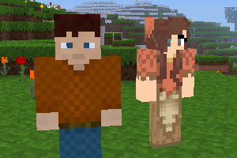

### Mobs Humans
  
**_Adds humans._**

**Version:** 0.3.0  
**Source code's license:** [EUPL v1.2][1] or later.  
**Textures' license:** [CC BY-SA v3.0][2], [CC BY-SA v4.0][3]

**Dependencies:** default (found in [Minetest Game][4]), mobs ([Mobs Redo][5])  

### Installation

Unzip the archive, rename the folder to mobs_humans and place it in  
../minetest/mods/

If you only want this to be used in a single world, place it in  
../minetest/worlds/WORLD_NAME/worldmods/

GNU+Linux - If you use a system-wide installation place it in  
~/.minetest/mods/

For further information or help see:  
https://wiki.minetest.net/Help:Installing_Mods

[1]: https://eur-lex.europa.eu/legal-content/EN/TXT/?uri=CELEX:32017D0863
[2]: https://creativecommons.org/licenses/by-sa/3.0/
[3]: https://creativecommons.org/licenses/by-sa/4.0/
[4]: https://github.com/minetest/minetest_game
[5]: https://forum.minetest.net/viewtopic.php?t=9917
